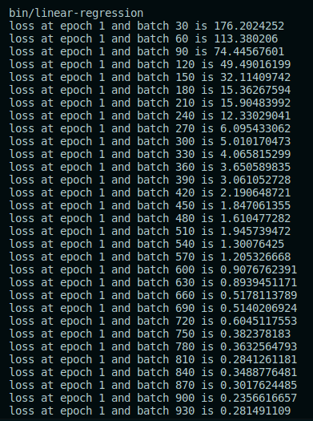

# Nanograd

An implementation of autograd engine in c++ from scratch. Inspired by andrej karpathys's first lecture in neural network from zero to hero (micrograd).
DISCLAIMER: this is highly unoptimized and for educational purposes only!!

Autograd, which stands for automatic gradient or automatic differentiation, is a concept used in Neural Network for the backpropagation step.
Basically, a neural network tries to locate the minimum point in a surface defined by a loss function and the net's weight.
The surfaces's global behavior is really a mystery (if not, this world wouldn't be a mystery lol), so we try to locate the minima step by step (by performing a gradient).
Calculus gives us a way to find a direction which is directed toward a local minima, by using differentiation.
Hence we move toward that direction, and how big we move is ruled by a hyperparameter called learning rate.
The value of the learning rate will affect our training duration, and there is a trade-off between large and small learning rate.
To make training faster, there are some optimizers available to customize the learning rate (like SGD, adam, etc.) which is mostly based on physics.

## Running

There are several main programs in src/bin folder, and there is a makefile rule for each main program.
For example, to run linear regression, just run `make linear-regression`

### Common issues

1.  When running matplotlib for visualization, the header Python.h not found

## Common QnA about Deep Learning

1. **Q:** Why does a combination of matrix operations (multiplications) can transform a space (training features) into another space (target features) well? (i.e. solve a specific ML task)
    
   **A:** Neural Network is a good [universal approximator](https://en.wikipedia.org/wiki/Universal_approximation_theorem). Basically, given a good enough weight, an NN can approximate this 'unknown' function (basically a blackbox), in which we only know the set of pairs of inputs and outputs. A tweet by @CristophMolnar said that: 'You can't "train" a model. The model always exists. It existed before you were born and it exists after your death. You can only find the model. "Training" is just your way of looking for the model's location in the infinite hypothesis space and binding its essence to silicon'. Universal approximation theorem ensure this existence.

## Update 1 : Simple linear MLP for a linear regression problem works!

